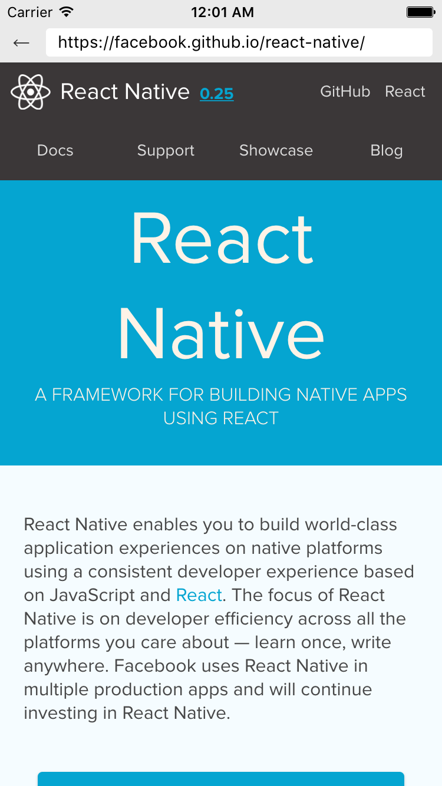

# react-native-mybrowser

A web browser component for React Native.

## Install

```
npm install react-native-mybrowser
```

## Usage

```javascript
import React, {
  Component,
  View
} from 'react-native';

import WebBrowser from 'react-native-mybrowser';

export default class SampleDemoApp extends Component {
  render() {
    return (
      <WebBrowser
        url='https://facebook.github.io/react-native'
      />
    );
  }
}
```

## Required props

|props        |description            |
|---          |---                    |
|url - string | web address           |

## Sample


